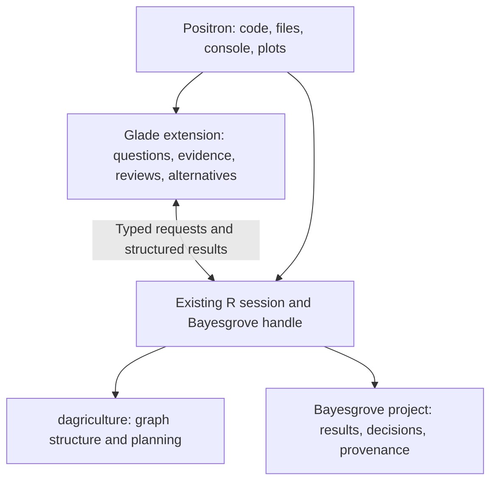

# Glade: goal and rebuild decision

My recommendation is to rebuild Glade's application layer as a Positron
extension. Keep Bayesgrove as the workflow engine. Treat the current desktop
client as a reference for useful interactions, rather than the foundation for
the next version.

This recommendation follows a working extension experiment, not just a toolkit
comparison. It does not mean that the full product design is settled.

## What Glade should help someone do

The proposed goal is to help a researcher decide what to trust and what to try
next, while keeping the relationship between their question, models, evidence,
and decisions inspectable.

A useful session should let them:

1. See the question being investigated and the model alternatives attached to it.
2. Inspect the relevant evidence, including plots, and tell whether it still
   applies to the current model.
3. Understand an unresolved criticism and record a decision with its rationale.
4. Return to the model code, make a revision, and see which evidence needs renewal.
5. Reopen the project and recover why one alternative was pursued or rejected.

The value is in keeping those activities connected. A graph canvas explains
provenance and dependencies, but a graph alone does not explain a model's
adequacy. An empty review queue does not establish adequacy either. Glade must
leave room for the researcher's questions and criticisms beyond the installed
workflow pack's checks.

## Why the current shape is a poor foundation

| Current commitment | Cost to the goal | Rebuild decision |
| --- | --- | --- |
| Electron shell, updater, installers, settings, and embedded terminal | Recreates much of the environment the researcher already uses. | Let Positron supply the workspace and console. |
| Glade-owned R process plus local HTTP/WebSocket relay | Creates another session owner and an integration layer to maintain. | Attach to an existing R session and handle. |
| TypeScript translation of workflow actions | Duplicates behavior Bayesgrove now exposes through `bg_execute_action()`. | Pass choices to Bayesgrove; validate presentation inputs at the extension boundary. |
| Graph-first navigation and kind-specific node UI | Encourages the interface to mirror execution structure before establishing what the researcher needs to inspect. | Lead with a question or review and its evidence; use the graph as supporting context. |
| Persistent copies of domain state | Adds another representation of results, reviews, and actions. | Bayesgrove owns persistence; the UI keeps only its current view and drafts. |
| Broad extension management and generic guided execution | Expands the UI before the central evidence-and-revision cycle is proven. | Start with one real review cycle. Add capabilities when that cycle needs them. |

The current client also depends on `bg_serve()`, removed in
[Bayesgrove 0.6.0](https://github.com/sims1253/bayesgrove/blob/68f94aeb30ebca9ab4bb75d96e5a2329de77b09c/NEWS.md). Repairing that obsolete transport would
not address the product mismatch above. The installed Bayesgrove exposes
`bg_next_actions()`, `bg_read_summaries()`, `bg_snapshot()`, and
`bg_execute_action()`; the experiment uses those functions directly.

## Proposed shape

TypeScript uses Effect and anti-slop. Bayesgrove owns scientific workflow
semantics and persistence. The editor owns the surrounding workbench. Glade owns
how the researcher navigates and interprets the evidence.

A rebuild should not introduce a general platform adapter or a new transport
framework. First make this work well in Positron. Ordinary VS Code needs its own
verified R-session integration. Qt or GPUI remain alternatives only if a
specific required interaction cannot work in the extension host.

## What the prototype established

The disposable source is committed as `827131f` on branch
`prototype/positron-review`, in
`apps/positron-prototype`. Its checkout is
[`../glade-positron-prototype`](https://github.com/sims1253/glade/blob/prototype/positron-review/apps/positron-prototype/README.md).
It is separate from the current cleanup work.

In an actual Positron 2026.09.1-2 extension host, the prototype:

- Attached to an existing R handle without opening another project session.
- Retrieved structured review and diagnostic data through `evaluateCode()`.
- Displayed the action's prompt and choices supplied by Bayesgrove.
- Recorded a choice and rationale using `bg_execute_action()` and refreshed the UI.
- Read the same persisted decision back from the user's R console.
- Rejected refresh while R was busy, without queueing it.
- Reported the missing handle after R restarted, without creating a session.

The scratch project uses explicitly simulated sampler diagnostics. It exercises
real Bayesgrove persistence and review behavior; it is not evidence about a
statistical model. A direct R probe also confirmed that a stale submission is
rejected before mutation. Strict anti-slop lint, TypeScript checking, and the
extension build pass without rule exceptions for the prototype.

[Positron documents access to active R sessions](https://positron.posit.co/extension-development.html).
Its [published runtime types](https://github.com/posit-dev/positron/blob/main/src/positron-dts/positron.d.ts)
include structured evaluation with explicit session selection and busy-session
rejection. The prototype exercises that path. Standard
[VS Code webviews](https://code.visualstudio.com/api/extension-guides/webview)
provide the custom panel.

## What this does not establish

The prototype covers project-scope review actions with enumerated choices.
It does not implement scientific plots, model comparison, branch navigation,
question editing, or a provenance graph. Its panel is a feasibility probe,
not a finished design. Screen-reader behavior and other desktop platforms have
not been validated.

Sharing R also means respecting its availability. The UI can keep showing its
last snapshot while R is busy, but cannot obtain fresh evidence from that session
until R is available. A production version needs clear freshness and session
status, preservation of drafts, and recovery from ambiguous mutation outcomes.
It must never automatically repeat a decision after a connection failure.

The next product trial should use one real analysis, with an actual diagnostic
plot, a competing model, a recorded criticism, and a code revision. That trial
should decide the navigation and evidence layout. It is the condition for
retiring the old client, not a reason to extend its server architecture now.

## Existing cleanup

The current working tree deletes the marketing app, SQLite cache and migrations,
unread event storage, and duplicate unused desktop preflight. A bounded in-memory
replay cache replaces SQLite. Old database files and Bayesgrove projects are
untouched. The client reports the missing `bg_serve()` interface before project
preparation.

That cleanup passes regular lint, workspace typechecks, Effect diagnostics,
the workspace build, and 136 unit tests (one skipped). Its four R integration
tests fail at the confirmed incompatibility with installed Bayesgrove 0.7.0.
The retained code has explicit anti-slop exceptions for 396 existing violations;
the prototype has none. The cleanup does not make the old application usable
with current Bayesgrove.

For PR verification, all four legacy integration tests pass with Bayesgrove
0.5.1 (`64d8f0c`) and dagriculture 0.1.6 (`5faf5e4`) in an isolated R library.
CI pins that pair by full commit hash. This tests the retained bridge without
claiming compatibility with current Bayesgrove.
